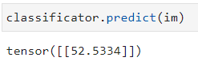
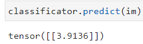

## **Report on Face Detection and Age estimation**
----------------------------------------------------------------------------------------------------------------

Files: 
- `scripts/prepare_new_dataset_RF.py` - Script for creation new dataset from APPA dataset by cropping images via RetinaFace and generation of new augmented images (x2)
- `scripts/UTK_generation.py` - Script for generation of new augmented images (x2) from provided UTK dataset
- `notebooks/age_estimator.ipynb` - Notebook containing:
    - visualization of RetinaFace model outputs
    - dataset preprocessing
    - training of Vision Transformer
    - pushing weights to model hub
- `app/models/ViT_age_estimation.py` - Class of the ViT model for age prediction
- `app/utils/image_utils.py` - Script with functions to detect faces in video/image via RetinaFace
- `app/main.py` - FastAPI app

Analysis of existing approaches was conducted based on: https://learnopencv.com/what-is-face-detection-the-ultimate-guide/.

## Face Detection

Datasets:
- positive (facial) dataset: http://mmlab.ie.cuhk.edu.hk/projects/CelebA.html
- negative (non facial) dataset: https://image-net.org/

Approaches: 
1. MediaPipe
    - ready-to-use solution, using MediaPipe library (https://github.com/googlesamples/mediapipe/blob/main/examples/face_detector/python/face_detector.ipynb, https://developers.google.com/mediapipe/solutions/vision/face_detector/python)
2. RetinaFace 
    - ready-to-use pipelinem using retinaface library (https://github.com/serengil/retinaface, https://github.com/deepinsight/insightface/tree/master/detection/retinaface, )

After thorough consideration of existing approaches, I decided to stick to **RetinaFace**.

For now I solve the task of detecting one person in the video and on the image, but I can also modify the code to be able to detect several people in the frame. So the logic is that I take **the most condifent** score and frame in terms of face detection. Also to decrease computational time I process every 5th frame in the video, so the time decreased from 87sec to 17sec per video for detection.

Also, for *FastAPI* there were created two endpoints for video and image upload by the user and after 

## Age estimation

Datasets:
- from this repository: https://github.com/WildChlamydia/MiVOLO/tree/main I used IMDB_clean, UTK, FairFaces. And APPA-REAL dataset from https://github.com/yu4u/age-estimation-pytorch/tree/master. Also it's possible to use https://www.kaggle.com/datasets/arashnic/faces-age-detection-dataset?select=train.csv.

Approaches: 
1. https://github.com/WildChlamydia/MiVOLO/tree/main
2. https://github.com/yu4u/age-estimation-pytorch/tree/master, etc.

For age estimation there were considered several options from https://paperswithcode.com/task/age-estimation
Due to lack of time I decided to stick to pretrained ViT from HuggingFaces and finetune on my own dataset and solve **Regression** task with RMSE loss.

So, I utilized ViT for regression task, especially, I utilized ViTForImageClassification.from_pretrained and specified num_labels = 1, which is the same as specifying problem_type = "regression". 
Also, there was written CustomTrainer inherited from Trainer object, which utilized RMSEloss and compute_metrics_RMSE. As optimizer Adam was chosen with lr=2e-4 and get_linear_schedule_with_warmup was applied. Regularization with weight decay was used as well.
ViT was trained on 3 epochs, but due to high computational resources I stopped training. 

**here are examples of model predictions:**

---------

---------

The metrics and process of model training are shown in `notebooks/age_estimator.ipynb`

Finally model weights were pushed to model hub: https://huggingface.co/Batr97/ViT_ordinary/tree/refs%2Fpr%2F1/